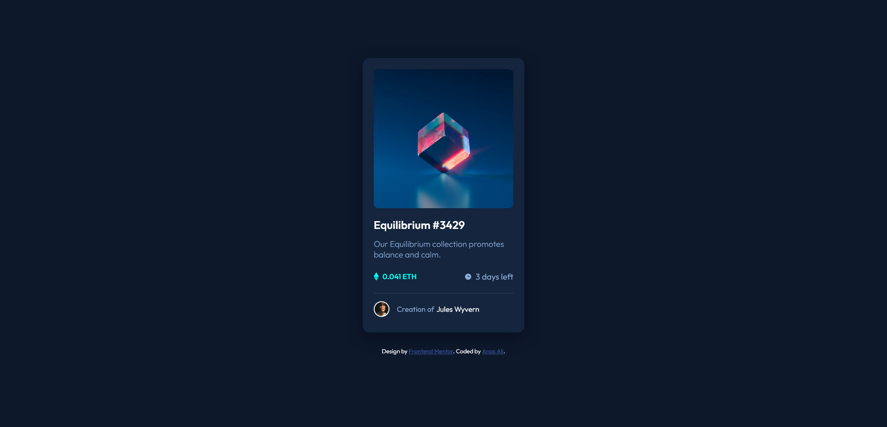

# Frontend Mentor - NFT preview card component solution

This is a solution to the [NFT preview card component challenge on Frontend Mentor](https://www.frontendmentor.io/challenges/nft-preview-card-component-SbdUL_w0U). Frontend Mentor challenges help you improve your coding skills by building realistic projects. 

## Table of contents

- [Overview](#overview)
  - [The challenge](#the-challenge)
  - [Screenshot](#screenshot)
  - [Links](#links)
- [My process](#my-process)
  - [Built with](#built-with)
  - [What I learned](#what-i-learned)
  - [Useful resources](#useful-resources)
- [Author](#author)


## Overview

### The challenge

Users should be able to:

- View the optimal layout depending on their device's screen size
- See hover states for interactive elements

### Screenshot




### Links

- Solution URL: [https://github.com/anas-cd/NFT-preview-card](https://github.com/anas-cd/NFT-preview-card)
- Live Site URL: [https://anas-cd.github.io/NFT-preview-card/](https://anas-cd.github.io/NFT-preview-card/)

## My process

### Built with

- CSS custom properties
- Flexbox
- Gulp
- SCSS


### What I learned

nice excersice about adding the "::before" and "::after" pseudo-elemnts in compination to ":hover" pseudo-class, here is my attempt of solving this

To see how you can add code snippets, see below:

```html
<div class="NftImageContainer">
  
</div>
```
```css
.NftImageContainer {

  &::before {
    content: "";
    background-color: $cayan;
    opacity: 0;
    width: 100%;
    height: 99%;
    position: absolute;
    border-radius: 10px;
    transition-duration: 0.5S;
    cursor: pointer;

  }
  &::after {
    opacity: 0;
    border-radius: 10px;
    content: url(../../images/icon-view.svg);
    height: 99%;
    position: absolute;
    width: 100%;
    left: 42%;
    top: 42%;
    transition-duration: 0.5S;
    cursor: pointer;
  }
  &:hover::before {

    content: "";
    background-color: $cayan;
    opacity: 0.5;
    width: 100%;
    height: 99%;
    position: absolute;
    border-radius: 10px;
    transition-duration: 0.5S;
    cursor: pointer;
  }
  &:hover::after {
    border-radius: 10px;
    content: url(../../images/icon-view.svg);
    height: 99%;
    position: absolute;
    width: 100%;
    left: 42%;
    top: 42%;
    transition-duration: 0.5S;
    cursor: pointer;
    opacity: 1;
  }
}
```

### Useful resources

- [GeeksforGeeks: pseudo elements and classes](https://www.geeksforgeeks.org/how-to-write-hover-condition-for-abefore-and-aafter-in-css/) - This helped me to understand the structure of pseudo-elements.


## Author

- Twitter - [Anas Ali](https://twitter.com/AnasCd)
- Frontend Mentor - [@anas-cd](https://www.frontendmentor.io/profile/anas-cd)


